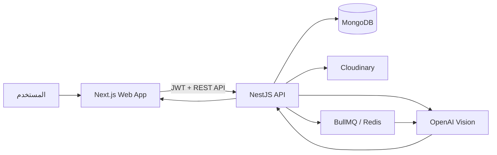
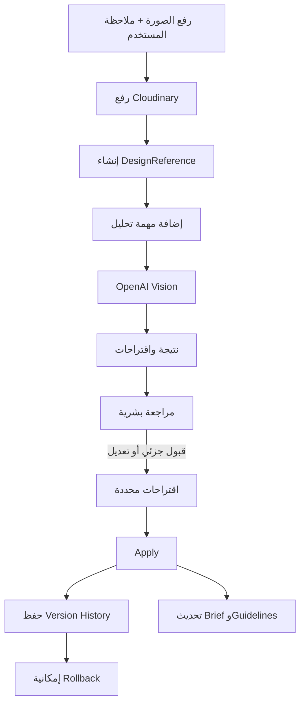

# توثيق مشروع AccountFlow

> آخر مراجعة للكود: 23 يوليو 2026  
> حالة المستند: توثيق مطابق للملفات الموجودة حاليًا داخل المشروع، وليس وصفًا نظريًا فقط.

---

## 1. ملخص المشروع

**AccountFlow** هو نظام داخلي لإدارة حسابات عملاء وكالات التسويق والتصميم، خصوصًا العملاء الطبيين والإبداعيين. يجمع النظام بيانات العميل، المسؤول عنه، المهام، الملفات والروابط، الـClient Brief، قواعد الهوية البصرية، التصميمات، ومراحل مراجعتها في مكان واحد.

يمتلك المشروع مسارين رئيسيين مرتبطين بالذكاء الاصطناعي:

1. **Design Review**: رفع تصميم جديد ومقارنته بقواعد العميل والمراجع المعتمدة، ثم إصدار نتيجة ونسبة توافق وتعديلات مقترحة.
2. **Design References**: رفع صورة مرجعية، استخراج الاتجاه البصري منها، مراجعة الاقتراحات يدويًا، ثم تطبيق العناصر المقبولة فقط على `Client Brief` و`Brand Guidelines`.

النظام مصمم ليحافظ على المراجعة البشرية؛ اقتراحات الذكاء الاصطناعي لا تُطبّق تلقائيًا على بيانات العميل.

---

## 2. أهداف النظام

- إنشاء مصدر مركزي موحد لمعلومات كل عميل.
- تسهيل تسليم الحساب من موظف إلى آخر بدون فقد المعلومات.
- حفظ الـBrief والهوية البصرية والتعليمات والممنوعات.
- إدارة العملاء والموظفين والمهام.
- فحص التصميمات قبل إرسالها للعميل.
- تحويل الصور المرجعية إلى تعليمات قابلة للتنفيذ.
- تسجيل التعديلات المهمة وإتاحة الرجوع إلى نسخة سابقة.
- دعم العربية والإنجليزية في واجهة الاستخدام.

---

## 3. التقنيات المستخدمة

### Frontend

- Next.js 15
- React 19
- TypeScript
- Tailwind CSS
- TanStack React Query
- Zustand
- Lucide React

### Backend

- NestJS 11
- TypeScript
- MongoDB
- Mongoose
- JWT + Passport
- bcrypt
- class-validator
- Cloudinary
- OpenAI API
- Sharp لتحليل الصور تقنيًا
- PDF Parse لاستخراج النصوص من ملفات PDF
- BullMQ + Redis للمهام الخلفية
- Jest للاختبارات

### إدارة المشروع

- pnpm Workspaces
- Turborepo
- ESLint

---

## 4. هيكل المشروع

```text
Dashboard Manger/
├── apps/
│   ├── web/                         # تطبيق Next.js
│   │   └── src/
│   │       ├── app/
│   │       │   ├── page.tsx         # لوحة التحكم الرئيسية
│   │       │   ├── login/page.tsx   # تسجيل الدخول
│   │       │   └── clients/
│   │       │       ├── DesignReferencesTab.tsx
│   │       │       └── [id]/design-review/page.tsx
│   │       ├── store/authStore.ts
│   │       └── utils/api.ts
│   └── api/                         # تطبيق NestJS
│       └── src/
│           ├── auth/
│           ├── users/
│           ├── clients/
│           ├── tasks/
│           ├── cloudinary/
│           └── design-review/
├── package.json
├── pnpm-workspace.yaml
├── pnpm-lock.yaml
├── turbo.json
├── .env.example
├── README.md
├── ARCHITECTURE.md
└── DESIGN_REVIEW_USAGE.md
```

---

## 5. طريقة عمل النظام



### التسلسل العام

1. يسجل المستخدم الدخول.
2. يحصل على JWT Access Token.
3. يحفظ الـFrontend بيانات المستخدم والـToken في `localStorage`.
4. ترسل جميع الطلبات المحمية بالـToken في `Authorization: Bearer`.
5. يتعامل NestJS مع MongoDB وCloudinary وخدمات الذكاء الاصطناعي.
6. تستخدم عمليات تحليل المراجع Redis/BullMQ عند توفره، وإلا تعمل بخلفية مؤقتة داخل نفس عملية الـAPI.

---

## 6. واجهات الـFrontend

## 6.1 تسجيل الدخول

المسار:

```text
/login
```

الوظائف:

- إدخال البريد الإلكتروني وكلمة المرور.
- استدعاء `POST /api/auth/login`.
- حفظ المستخدم والـAccess Token في Zustand و`localStorage`.
- تحويل المستخدم إلى لوحة التحكم بعد نجاح الدخول.

## 6.2 لوحة التحكم الرئيسية

المسار:

```text
/
```

تحتوي حاليًا على:

- ملخص العملاء والمهام.
- عرض العملاء والبحث والتصفية.
- إنشاء وتعديل وحذف العملاء.
- رفع Brief كنص أو PDF واستخراج ملخص بالذكاء الاصطناعي.
- إدارة المهام وحالتها وأولويتها والمسؤول عنها.
- إدارة المستخدمين وفق الصلاحيات المتاحة.
- Toast messages للحالات الناجحة والأخطاء.
- واجهة Responsive.
- تبديل اللغة بين العربية والإنجليزية.

## 6.3 صفحة مراجعة التصميم

المسار:

```text
/clients/:id/design-review
```

الوظائف:

- قراءة وتعديل قواعد تصميم العميل.
- استخراج مسودة Brand Guidelines من نص أو PDF.
- رفع تصميم إلى Cloudinary.
- حفظ نوع التصميم واسم الحملة والرسالة والـCTA والمصمم والإصدار.
- تشغيل التحليل التقني وتحليل OpenAI Vision.
- عرض النتيجة والدرجات والمخالفات والتحذيرات.
- اعتماد التصميم أو طلب تعديلات أو رفضه.
- اعتماد التصميم كمرجع بصري للعميل.
- حذف التصميم.

## 6.4 مراجع التصميم الذكية

المكون:

```text
apps/web/src/app/clients/DesignReferencesTab.tsx
```

الوظائف:

- رفع JPG أو PNG أو WEBP.
- إضافة وصف يوضح ما أعجب العميل وما يجب تجاهله.
- متابعة حالة التحليل.
- عرض نتيجة تحليل الصورة.
- مراجعة اقتراحات الـBrief والـGuidelines.
- قبول أو رفض وتعديل الاقتراحات.
- تطبيق العناصر المعتمدة فقط.
- عرض سجل التعديلات.
- Rollback إلى نسخة سابقة.
- Soft Delete للمراجع.

## 6.5 إدارة حالة الواجهة

يستخدم `authStore.ts` لتخزين:

- المستخدم الحالي.
- Access Token.
- اللغة `ar/en`.
- حالة القائمة الجانبية.
- التبويب النشط.
- العميل المحدد.
- حالة Hydration بين Server Rendering والمتصفح.

---

## 7. وحدات الـBackend

## 7.1 Auth Module

المسؤوليات:

- تسجيل مستخدم جديد.
- تسجيل الدخول.
- تشفير كلمة المرور باستخدام bcrypt.
- إصدار JWT Access Token.
- حماية المسارات باستخدام `JwtAuthGuard`.
- التحقق من الأدوار باستخدام `RolesGuard`.

الأدوار الحالية:

```text
admin
manager
member
```

ملاحظة: متغير `JWT_REFRESH_SECRET` موجود في البيئة، لكن Refresh Token Rotation غير منفذ حاليًا.

## 7.2 Users Module

بيانات المستخدم:

- البريد الإلكتروني.
- كلمة المرور المشفرة.
- الاسم الإنجليزي.
- الاسم العربي.
- الدور.

يمكن إنشاء أول Admin بصورة اختيارية وآمنة عبر متغيرات البيئة:

```text
BOOTSTRAP_ADMIN_EMAIL
BOOTSTRAP_ADMIN_PASSWORD
BOOTSTRAP_ADMIN_NAME
```

يجب أن تكون كلمة المرور 12 حرفًا على الأقل، ثم تُحذف متغيرات Bootstrap بعد إنشاء الحساب. التسجيل العام لا يستطيع اختيار دور، وإنشاء مستخدم جديد متاح للـAdmin فقط.

## 7.3 Clients Module

بيانات العميل الحالية:

- الاسم الإنجليزي والعربي.
- المجال.
- الحالة.
- Account Manager.
- نسبة اكتمال الملف.
- المدينة والدولة.
- رابط Google Drive.
- رابط الشعار.
- الخطوط.
- الـBrief.
- آخر مشروع مكتمل.
- آخر نشاط.
- تاريخ الأرشفة.
- Design Guidelines.
- التصميمات المعتمدة كمراجع.

حالات العميل:

```text
lead
onboarding
active
holding
completed
not_active
archived
```

### حساب اكتمال الملف

تبدأ النسبة من 40% للبيانات الأساسية، ثم تضاف نسبة بناءً على وجود:

- الاسم العربي.
- الدولة.
- رابط Drive.
- الشعار.
- الخطوط.
- الـBrief.
- آخر مشروع.
- Account Manager.

## 7.4 Tasks Module

بيانات المهمة:

- العنوان والوصف.
- مكتملة أو غير مكتملة.
- الأولوية: `low`, `medium`, `high`.
- تاريخ التسليم.
- العميل.
- الموظف المسؤول.
- رابط Drive.
- معلومات إضافية.
- قائمة المستخدمين المسموح لهم بالوصول.
- رابط ملف التسليم النهائي.

## 7.5 Cloudinary Module

- يرفع الملفات داخل مجلد `accountflow`.
- يعيد `secure_url` و`public_id`.
- يستخدم حاليًا في التصميمات والصور المرجعية.

## 7.6 Design Review Module

وحدة مجمعة تشمل:

- قواعد الهوية البصرية.
- استخراج النص من PDF.
- تحليل التصميمات.
- تحليل الصور المرجعية.
- الحساب الرقمي للنتائج.
- Queue jobs.
- Version History وRollback.

---

## 8. Brand Guidelines

القواعد المدعومة حاليًا:

### مكتبة الشعارات المعتمدة

توجد إدارة هذه البيانات داخل ملف العميل في تبويب **Design References** لأنها قواعد ثابتة للعميل. تعرض صفحة Design Review ملخصًا للقراءة فقط وتستخدم القواعد أثناء التحليل.

يمكن إضافة أكثر من Logo للعميل مع:

- صورة الشعار الأصلية.
- اسم النسخة.
- النوع: Primary أو Arabic أو English أو White أو Black أو Icon.
- هل وجوده إلزامي؟
- المكان المتوقع داخل التصميم.
- المكان الدقيق لكل شعار كنسبة من مساحة التصميم:
  - `X%` لمركز الشعار أفقيًا.
  - `Y%` لمركز الشعار رأسيًا.
  - `Width%` لعرض الشعار بالنسبة للتصميم.
  - `Tolerance%` هو نطاق السماحية حول قيم `X%` و`Y%` و`Width%`، وليس نقطة إلزامية دقيقة. مثال: `X=88%` و`Tolerance=5%` يسمح بمركز أفقي من `83%` إلى `93%`.
  - `Margin%` للمسافة الآمنة من حواف التصميم.
- يمكن سحب صورة الشعار الحقيقية بالماوس داخل معاينة التصميم، وتتحدث قيم X وY تلقائيًا، ولا يسمح السحب بتجاوز الـSafe Margin. يعرض النطاق الأزرق الشفاف المساحة المقبولة طبقًا لقيمة `Tolerance%`.
- الخلفية المسموحة.

أثناء Design Review يقارن AI التصميم بصورة الشعار الأصلية، ويتحقق من وجوده، النسخة الصحيحة، موضعه، وعدم تمديده أو قصه أو تغيير ألوانه.

### الأرقام وبيانات التواصل

يمكن حفظ أكثر من:

- Phone.
- WhatsApp.
- Hotline.
- Social Handle.
- Website.

ويتم تحديد القيمة الدقيقة والمكان المتوقع وهل التطابق الحرفي إلزامي. يفحص Design Review وجود القيمة وصحة الأرقام أو الحروف وموضعها. إذا كانت غير مقروءة يعيد `unknown` للمراجعة البشرية بدل اختراع قيمة.

### الاتجاه والمقاس

- Portrait أو Landscape أو Square.
- العرض والارتفاع.
- Aspect Ratio.
- سماحية اختلاف الأبعاد بالبكسل.

### الألوان

- Black & White أو Brand Colors أو Custom.
- الألوان المسموحة.
- الألوان الممنوعة.
- السماح بالـGrayscale.
- Color Tolerance.
- أقصى نسبة للألوان غير الرمادية.

### Header والشعار

- هل الشعار مطلوب؟
- موضع الشعار.
- هل يسمح بتكرار الشعار؟
- الهوامش المتوقعة.
- مرجع الشعار.

### Footer

- هل الـFooter مطلوب؟
- رقم الهاتف.
- Social Handle.
- Separator والألوان المسموحة له.

### Typography

- الخطوط المسموحة.
- خط العناوين.
- خط النص.
- الخطوط الممنوعة.

### Content Rules

- العناصر المطلوبة.
- العناصر الممنوعة.
- الأساليب المفضلة.
- الأساليب الممنوعة.
- Design Instructions.
- Things to Avoid.
- ملاحظات إضافية.

---

## 9. مراجعة التصميمات

تمر المراجعة بطبقتين:

### Layer A: التحليل التقني

يستخدم `Sharp` لفحص:

- العرض والارتفاع.
- الاتجاه.
- Aspect Ratio.
- حجم الملف.
- نسبة الألوان غير الرمادية.
- أكثر خمسة ألوان انتشارًا بصورة تقريبية.

ثم يقارنها بالقواعد المحفوظة للعميل.

### Layer B: تحليل AI Vision

يستخدم OpenAI لتحليل:

- الالتزام بالهوية.
- المحتوى.
- الجودة البصرية.
- وجود الشعار ومكانه.
- الـFooter.
- الخطوط والنصوص.
- المقارنة بالمراجع البصرية المعتمدة.
- اقتراح Prompt يساعد المصمم على تنفيذ التعديلات.

### أوزان النتيجة

| القسم | الوزن |
|---|---:|
| Technical | 35% |
| Brand | 40% |
| Content | 15% |
| Visual Quality | 10% |

### حالات النتيجة

| الحالة | المعنى |
|---|---|
| `approved` | التصميم متوافق |
| `approved_with_notes` | مقبول مع ملاحظات |
| `changes_required` | يحتاج تعديلات |
| `manual_review_required` | البيانات أو الثقة غير كافية |

### قواعد القرار

- فشل قاعدة حرجة يؤدي غالبًا إلى `changes_required`.
- نتيجة أقل من 80 تؤدي إلى `changes_required`.
- ثقة أقل من 65 أو نقص بيانات القواعد يؤدي إلى مراجعة بشرية.
- نتيجة 90 أو أكثر وثقة 75 أو أكثر تسمح بـ`approved`.

القواعد الحرجة تشمل الأبعاد، الاتجاه، شرط الأبيض والأسود، وجود الشعار، تكراره، والـFooter وبيانات التواصل المطلوبة.

---

## 10. تحليل الصور المرجعية

### دورة العمل



### حالات المرجع

```text
uploaded
analyzing
ready_for_review
partially_approved
approved
rejected
failed
```

### البيانات المستخرجة

- الاتجاه البصري والمزاج.
- الألوان ونسب استخدامها.
- Typography واقتراحات الخطوط.
- Layout والتسلسل البصري.
- أسلوب الصور والإضاءة والخلفيات.
- الأيقونات والأشكال والظلال والـGradients.
- نبرة المحتوى والـCTA.
- تغييرات مقترحة للـBrief.
- تغييرات مقترحة للـBrand Guidelines.
- Design Instructions.
- Things to Avoid.
- التعارضات والحالات المحتاجة لمراجعة.

### ضوابط الرفع

- الحد الأقصى 10MB.
- الصيغ المسموحة: JPG، PNG، WEBP.
- منع SVG والملفات التنفيذية.

### تطبيق الاقتراحات

- لا يطبق النظام إلا العناصر المحددة كـ`approved`.
- تعديلات الـBrief تُضاف كتوصية معتمدة بدل استبدال النص بالكامل.
- القوائم داخل Guidelines يتم دمجها بدون تكرار.
- الحقول الأخرى تُحدّث بالقيمة المعتمدة.
- يحفظ النظام القيم القديمة والجديدة ونسخة كاملة قبل التعديل.
- تطبيق الاقتراحات وRollback متاحان لـAdmin وManager فقط.

---

## 11. قاعدة البيانات

Collections الرئيسية الناتجة عن الـSchemas:

| Collection | الاستخدام |
|---|---|
| Users | المستخدمون والأدوار |
| Clients | بيانات العملاء والهوية والـBrief |
| Tasks | مهام الفريق |
| Designs | التصميمات المرفوعة |
| DesignReviews | نتائج مراجعة التصميم |
| DesignReferences | الصور المرجعية وتحليلها |
| ClientHistories | نسخ Brief وGuidelines السابقة |

### العلاقات الأساسية

- العميل لديه Account Manager من Users.
- المهمة قد ترتبط بعميل ومستخدم.
- التصميم يتبع عميلًا.
- Design Review يرتبط بتصميم وعميل.
- Design Reference يتبع عميلًا وموظفًا قام برفعه.
- Client History قد يرتبط بالمرجع الذي تسبب في التعديل.

### الفهارس

- بحث نصي على اسم العميل العربي والإنجليزي والمجال.
- فهرسة حالة العميل وآخر نشاط.
- فهارس لعلاقات العملاء والمهام والتصميمات والمراجعات.

---

## 12. توثيق REST API

الـBase URL الافتراضي:

```text
http://localhost:4000/api
```

جميع المسارات التالية محمية بـJWT باستثناء Register وLogin.

### Authentication

| Method | Endpoint | الوظيفة |
|---|---|---|
| POST | `/auth/register` | إنشاء مستخدم |
| POST | `/auth/login` | تسجيل الدخول |
| GET | `/auth/profile` | بيانات المستخدم الحالي |

### Users

| Method | Endpoint | الوظيفة | الصلاحية |
|---|---|---|---|
| GET | `/users` | قائمة المستخدمين | مستخدم مسجل |
| DELETE | `/users/:id` | حذف مستخدم | Admin |

### Clients

| Method | Endpoint | الوظيفة | الصلاحية |
|---|---|---|---|
| GET | `/clients` | عرض وبحث وتصفية العملاء | مستخدم مسجل |
| GET | `/clients/:id` | تفاصيل العميل | مستخدم مسجل |
| POST | `/clients` | إنشاء عميل | Admin/Manager |
| PUT | `/clients/:id` | تعديل العميل | مستخدم مسجل حاليًا |
| GET | `/clients/archive` | عرض العملاء المؤرشفين | Admin/Manager |
| DELETE | `/clients/:id` | أرشفة العميل بدون حذف بياناته | Admin/Manager |
| POST | `/clients/:id/restore` | استرجاع العميل المؤرشف | Admin/Manager |

### Tasks

| Method | Endpoint | الوظيفة |
|---|---|---|
| GET | `/tasks` | قائمة المهام |
| GET | `/tasks/:id` | تفاصيل مهمة |
| POST | `/tasks` | إنشاء مهمة |
| PUT | `/tasks/:id` | تعديل مهمة |
| DELETE | `/tasks/:id` | حذف مهمة |

يمكن التصفية عبر:

```text
/tasks?completed=true
/tasks?completed=false
```

### Upload

| Method | Endpoint | الوظيفة |
|---|---|---|
| POST | `/upload` | رفع ملف إلى Cloudinary |

### Guidelines وBrief

| Method | Endpoint | الوظيفة |
|---|---|---|
| GET | `/clients/:clientId/design-guidelines` | قراءة القواعد |
| PUT | `/clients/:clientId/design-guidelines` | حفظ القواعد |
| POST | `/clients/:clientId/design-guidelines/extract` | استخراج مسودة من نص/PDF |
| POST | `/clients/:clientId/extract-brief` | تلخيص Brief من نص/PDF |

### Designs

| Method | Endpoint | الوظيفة |
|---|---|---|
| POST | `/clients/:clientId/designs` | رفع تصميم |
| GET | `/clients/:clientId/designs` | قائمة التصميمات |
| GET | `/clients/:clientId/designs/:designId` | تصميم واحد |
| POST | `/clients/:clientId/designs/:designId/analyze` | تشغيل التحليل |
| GET | `/clients/:clientId/designs/:designId/review` | نتيجة المراجعة |
| POST | `/clients/:clientId/designs/:designId/decision` | قرار بشري |
| POST | `/clients/:clientId/designs/:designId/approve-reference` | اعتماده كمرجع |
| DELETE | `/clients/:clientId/designs/:designId` | حذف التصميم |

### Design References

| Method | Endpoint | الوظيفة |
|---|---|---|
| POST | `/clients/:clientId/design-references` | رفع مرجع |
| POST | `/clients/:clientId/design-references/:id/analyze` | بدء التحليل |
| GET | `/clients/:clientId/design-references` | قائمة المراجع |
| GET | `/clients/:clientId/design-references/:id` | مرجع واحد |
| PATCH | `/clients/:clientId/design-references/:id/review` | حفظ المراجعة |
| POST | `/clients/:clientId/design-references/:id/apply` | تطبيق المقبول |
| DELETE | `/clients/:clientId/design-references/:id` | Soft Delete |
| POST | `/clients/:clientId/design-references/:id/restore` | استرجاع |

### History

| Method | Endpoint | الوظيفة |
|---|---|---|
| GET | `/clients/:clientId/history` | سجل الإصدارات |
| POST | `/clients/:clientId/history/:historyId/rollback` | استرجاع إصدار |

---

## 13. متغيرات البيئة

أنشئ `.env` في جذر المشروع:

```env
NODE_ENV=development
WEB_URL=http://localhost:3000
API_URL=http://localhost:4000

MONGODB_URI=mongodb://localhost:27017/accountflow

JWT_ACCESS_SECRET=replace-with-a-long-random-secret
JWT_REFRESH_SECRET=replace-with-another-long-random-secret

CLOUDINARY_CLOUD_NAME=
CLOUDINARY_API_KEY=
CLOUDINARY_API_SECRET=

OPENAI_API_KEY=
OPENAI_DESIGN_REVIEW_MODEL=gpt-4o-mini

REDIS_URL=redis://127.0.0.1:6379
```

ملاحظات:

- MongoDB مطلوب لتشغيل الـAPI.
- Cloudinary مطلوب لرفع الصور.
- بدون OpenAI Key قد تستخدم بعض الخدمات Mock/Fallback حسب المسار.
- Redis اختياري أثناء التطوير؛ يوجد In-Memory Fallback، لكنه غير مناسب للإنتاج.

---

## 14. التشغيل المحلي

المتطلبات:

- Node.js حديث.
- pnpm.
- MongoDB محلي أو MongoDB Atlas.
- Redis اختياري للتطوير ومطلوب عمليًا للإنتاج.

الأوامر:

```bash
pnpm install
pnpm dev
```

العناوين:

```text
Frontend: http://localhost:3000
API:      http://localhost:4000/api
```

أوامر الجودة:

```bash
pnpm lint
pnpm typecheck
pnpm build
pnpm --filter @accountflow/api test
```

---

## 15. الاختبارات الموجودة

الـBackend يحتوي على اختبارات لـ:

- Technical Checks.
- Score Calculator.
- Guidelines Extraction.
- Design Reference workflow.

لا توجد حاليًا تغطية موثقة كافية لـ:

- End-to-End لمسار تسجيل الدخول.
- End-to-End لرفع التصميم ومراجعته.
- Playwright للواجهة.
- صلاحيات الوصول لكل عميل.
- فشل Cloudinary أو OpenAI أو Redis.

تعذر تشغيل الاختبارات وTypeScript checks أثناء إعداد هذا المستند لأن pnpm حاول إعادة إنشاء `node_modules` ورفض العملية في بيئة بدون TTY. هذه مشكلة بيئة/تثبيت، وليست إثباتًا على نجاح أو فشل الاختبارات نفسها.

---

## 16. نقاط القوة الحالية

- فصل واضح بين الـFrontend والـBackend.
- استخدام TypeScript في الجانبين.
- وجود ValidationPipe عالمي.
- حماية غالبية المسارات بـJWT.
- وجود Roles Guard.
- عدم تطبيق اقتراحات الذكاء الاصطناعي تلقائيًا.
- حفظ Snapshot قبل تعديل Brief وGuidelines.
- وجود Rollback.
- الجمع بين تحليل تقني Deterministic وتحليل AI Vision.
- استخدام Background Queue مع Fallback للتطوير.
- منع أنواع ملفات خطرة في Design References.
- استخدام React Query لإدارة Server State.
- دعم أولي للعربية والإنجليزية.

---

## 17. المخاطر والمشكلات الحالية

هذه النقاط مهمة قبل اعتبار المشروع Production Ready:

### P0 — يجب إصلاحها قبل النشر

1. **تخزين JWT في localStorage**  
   يعرض الـToken لمخاطر XSS. الأفضل Access Token قصير العمر وRefresh Token داخل `httpOnly secure cookie`.

2. **لا يوجد Refresh Token حقيقي**  
   رغم وجود `JWT_REFRESH_SECRET`.

3. **فحص الملفات ما زال يحتاج Malware Scanning**  
   تم توحيد MIME والحجم الأساسي، لكن الإنتاج يحتاج فحص محتوى الملفات وعدم الاكتفاء بالامتداد أو MIME القادم من العميل.

### P1 — مهمة للاستقرار

1. `next lint` لم يعد المسار الأفضل مع بعض إصدارات Next الحديثة؛ يجب توحيد إعداد ESLint والأوامر.

2. لا توجد Swagger/OpenAPI documentation.

3. لا توجد Rate Limiting واضحة على عمليات AI.

4. In-Memory Queue قد تفقد المهام عند إعادة تشغيل السيرفر.

5. عند تشغيل السيرفر، المراجع العالقة تتحول إلى `failed` بدل محاولة استئنافها.

6. أنواع عديدة في Design Reference تستخدم `any` و`Object` بدون Schema Validation صارم لرد الذكاء الاصطناعي.

7. لا يوجد Secret Manager أو تشفير للبيانات الحساسة.

8. النص العربي داخل بعض أدوات الطرفية قد يظهر بترميز غير صحيح ويجب الحفاظ على UTF-8.

### P2 — تحسينات منتج وهندسة

- إضافة Pagination للعملاء والمهام والمراجع.
- إضافة Search مخصص باستخدام Atlas Search أو Meilisearch.
- إضافة Contacts وServices وProjects وNotes وHandover وApprovals.
- إضافة Autosave وDrafts للنماذج الطويلة.
- إضافة Notifications.
- إضافة Audit Log عام، وليس لتعديلات Brief/Guidelines فقط.
- إضافة Sentry وStructured Logging وHealth Checks.
- إضافة Docker Compose لـMongoDB وRedis.
- إضافة CI/CD.
- إضافة React Hook Form وZod.
- إضافة نظام ترجمة فعلي مثل `next-intl` بدل النصوص الموزعة داخل المكونات.
- إضافة تخزين S3-compatible للملفات الكبيرة مثل PSD وAI وEPS وDOCX.

---

## 18. نطاق الـMVP المقترح

### موجود حاليًا بدرجات متفاوتة

- تسجيل الدخول والأدوار.
- المستخدمون.
- العملاء.
- المهام.
- Brief.
- Design Guidelines.
- رفع التصميمات.
- AI Design Review.
- AI Design References.
- Cloudinary.
- History وRollback لمراجع التصميم.

### مطلوب لاستكمال MVP

- Refresh Token آمن.
- صلاحيات على مستوى العميل.
- Contacts.
- Services.
- Notes/Comments.
- Files and Links library.
- Handover Summary.
- Soft Delete شامل.
- Audit Log عام.
- Pagination.
- اختبارات E2E.
- تحسين الترجمة وRTL.
- صفحة Client Profile متكاملة بدل الاعتماد الكبير على Dashboard واحد.

---

## 19. خطة تطوير مقترحة

### المرحلة 1: الأمان والاستقرار

- إزالة حساب Admin الافتراضي.
- تنفيذ Access/Refresh Tokens.
- نقل Refresh Token إلى Cookie آمنة.
- إضافة Rate Limiting وHelmet وCORS allowlist.
- ضبط صلاحيات كل Resource.
- إصلاح Dependencies والترميز.
- توحيد Validation للصور وردود AI.

### المرحلة 2: استكمال ملف العميل

- Client Profile متعدد التبويبات.
- Contacts وServices وTeam Assignment.
- Notes وFiles وDrive Links.
- Timeline وAudit Log.
- Handover.
- Archive/Restore شامل.

### المرحلة 3: تحسين عمليات التصميم

- ربط المراجع المعتمدة بمقارنة التصميم.
- تحسين Review UI.
- إضافة Queue Monitoring وRetry.
- إضافة Prompt Versioning.
- مقارنة نسخ التصميمات.
- Approval workflow متعدد المراحل.

### المرحلة 4: التقارير والتكاملات

- تقارير العملاء والمهام والأداء.
- Calendar.
- Google Drive/Gmail.
- Notifications.
- Contracts/Invoices.

### المرحلة 5: الذكاء الاصطناعي المتقدم

- Semantic Search.
- استخراج بيانات Brief أكثر تنظيمًا.
- كشف تعارض التعليمات.
- Brand Compliance متقدم.
- اقتراح الموظف الأنسب حسب ضغط العمل.

---

## 20. تعريف النجاح

يعتبر النظام ناجحًا عندما يستطيع موظف جديد:

- فتح ملف العميل وفهمه خلال دقائق.
- معرفة المسؤولين والخدمات والمهام المفتوحة.
- الوصول إلى الشعار والخطوط والألوان والملفات.
- معرفة ما يحبه العميل وما يرفضه.
- رفع تصميم والحصول على مراجعة قابلة للتنفيذ.
- استخدام صورة معتمدة كمرجع لبقية التصميمات.
- مراجعة أي اقتراح AI قبل تطبيقه.
- تسليم الحساب لموظف آخر بدون فقد معلومات.
- الرجوع إلى نسخة سابقة عند تطبيق تعديل خاطئ.

---

## 21. ملفات مرجعية داخل المشروع

- `README.md`: تشغيل سريع ونطاق مختصر.
- `ARCHITECTURE.md`: توصيات معمارية وخطة إنتاج.
- `DESIGN_REVIEW_USAGE.md`: شرح استخدام مراجعة التصميم.
- `PROJECT_DOCUMENTATION_AR.md`: التوثيق الشامل الحالي.

---

## 22. الخلاصة

المشروع حاليًا **Prototype/MVP متقدم** وليس Production Ready. أقوى جزء فيه هو مسار إدارة التصميم: حفظ Guidelines، فحص تقني، تحليل AI، مراجع بصرية، مراجعة بشرية، Version History وRollback.

الأولوية التالية ليست إضافة AI أكثر، بل تقوية الأمان والصلاحيات، تنظيف الحزم، توحيد التحقق من البيانات، واستكمال ملف العميل الأساسي. بعد ذلك يمكن توسيع التقارير والتكاملات والذكاء الاصطناعي بثقة.
