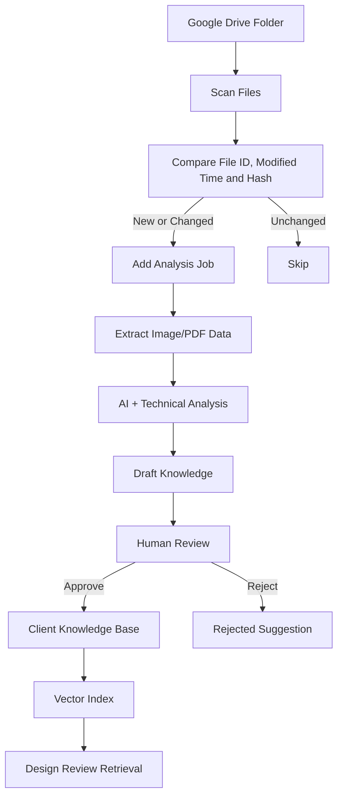

# تحديث Visual Knowledge Base وGoogle Drive Intelligence

> اسم التحديث المقترح: **Client Visual Intelligence**  
> الحالة: مواصفات تطوير للنسخة القادمة  
> تاريخ الإنشاء: 23 يوليو 2026

---

## 1. ملخص التحديث

يضيف هذا التحديث قاعدة معرفة بصرية مستقلة لكل عميل، يتم بناؤها من:

- Brand Guidelines الرسمية.
- Client Brief.
- Design References المعتمدة.
- التصميمات السابقة التي وافق عليها العميل.
- التصميمات المرفوضة وأسباب رفضها.
- تعليمات Account Manager.
- تصميمات الحملات الموسمية.
- الملفات الموجودة داخل Google Drive الخاص بالعميل.

عند تشغيل **Design Review**، يسترجع النظام المعلومات والمراجع الأكثر ارتباطًا بالتصميم الجديد، ثم يستخدمها مع قواعد العميل الرسمية لتقليل أخطاء المراجعة وتحسين دقة اقتراحات الذكاء الاصطناعي.

هذا النظام لا يقوم بتدريب Model منفصل لكل عميل، بل يستخدم:

```text
Visual Analysis + Structured Knowledge + Vector Search + RAG
```

---

## 2. المشكلة الحالية

يستخدم Design Review حاليًا بيانات Design References المعتمدة فعليًا، لكن الاستخدام الحالي يعتمد أساسًا على نتائج التحليل النصية المحفوظة لكل Reference.

القيود الحالية:

- لا توجد مزامنة تلقائية مع Google Drive.
- لا يتم تحليل تاريخ تصميمات العميل بالكامل.
- لا يوجد بحث بالتشابه لاختيار أفضل المراجع.
- لا يوجد فصل واضح بين القواعد الدائمة وقواعد الحملات المؤقتة.
- أسباب رفض التصميمات ليست جزءًا من ذاكرة العميل المنظمة.
- قد يتم إرسال مراجع كثيرة أو غير مرتبطة إلى AI.
- لا توجد درجة موثوقية تراكمية لكل قاعدة.
- لا يظهر دائمًا مصدر المعلومة للمستخدم.

---

## 3. أهداف التحديث

1. بناء ذاكرة بصرية خاصة بكل عميل.
2. تحليل التصميمات السابقة المعتمدة والمرفوضة.
3. ربط فولدر Google Drive الخاص بالعميل.
4. منع إعادة تحليل الملفات التي لم تتغير.
5. استخراج القواعد والتفضيلات المتكررة.
6. مراجعة أي اقتراح قبل إضافته إلى ملف العميل.
7. اختيار المراجع الأقرب لكل تصميم جديد.
8. تحسين دقة Design Review وتقليل النتائج العامة أو الخاطئة.
9. الاحتفاظ بمصدر كل معلومة.
10. فصل الهوية الدائمة عن الحملات المؤقتة.

---

## 4. المصطلحات الأساسية

### Visual Knowledge Base

قاعدة معرفة منظمة تحتوي على القواعد والتفضيلات والمراجع البصرية الخاصة بالعميل.

### Knowledge Asset

أي ملف يستخدم لبناء معرفة العميل، مثل:

- صورة تصميم.
- PDF Brand Guidelines.
- Client Brief.
- شعار.
- تصميم معتمد.
- تصميم مرفوض.
- Reference خارجي.

### Visual Rule

قاعدة أو تفضيل مستخرج من Asset، مثل:

- استخدام الشعار أعلى اليمين.
- تجنب الخلفيات الداكنة.
- استخدام صور واقعية.
- تقليل النصوص داخل التصميم.

### RAG

استرجاع المعلومات الأقرب للتصميم الجديد وإرسالها إلى نموذج الذكاء الاصطناعي وقت المراجعة، بدل تدريب نموذج جديد أو إرسال كل ملفات العميل.

---

## 5. مصادر المعرفة

يجب أن يدعم النظام المصادر التالية:

| المصدر | نوع المعرفة | الأولوية |
|---|---|---:|
| Brand Guidelines | قواعد رسمية | الأعلى |
| تعليمات بشرية معتمدة | قواعد رسمية | الأعلى |
| Client Brief | أهداف ونبرة وتفضيلات | مرتفعة |
| Approved Designs | أمثلة إيجابية | مرتفعة |
| Rejected Designs | أمثلة سلبية | مرتفعة |
| Approved Design References | اتجاه بصري | متوسطة |
| Campaign Guidelines | قواعد مؤقتة | حسب الحملة |
| AI Inference | اقتراح يحتاج مراجعة | منخفضة حتى اعتماده |

عند وجود تعارض، تكون الأولوية:

```text
Human Approved Rule
→ Official Brand Guidelines
→ Client Brief
→ Campaign Rule
→ Approved Designs
→ Approved References
→ AI Inference
```

---

## 6. هيكل Google Drive المقترح

```text
Client Name/
├── 01_Brand_Guidelines/
├── 02_Approved_Designs/
│   ├── Social Media/
│   ├── Stories/
│   ├── Reels/
│   ├── Campaigns/
│   └── Print/
├── 03_Rejected_Designs/
├── 04_Logos_Fonts_Colors/
├── 05_Client_Briefs/
├── 06_Reference_Designs/
├── 07_Campaigns/
│   ├── Ramadan/
│   ├── Awareness/
│   └── Offers/
└── 99_Ignore/
```

### قواعد المجلدات

- `Approved_Designs`: تصميمات وافق عليها العميل.
- `Rejected_Designs`: تصميمات مرفوضة، ويجب إضافة سبب الرفض.
- `Reference_Designs`: اتجاهات يحبها العميل، لكنها ليست قواعد رسمية.
- `Campaigns`: تعليمات مؤقتة مرتبطة بحملة محددة.
- `Ignore`: ملفات لا يتم تحليلها.
- `Drafts`: لا يتم اعتبارها معرفة معتمدة.

---

## 7. إعداد ربط Google Drive

داخل Client Profile يضاف قسم:

```text
Google Drive Intelligence
```

الحقول:

- Google Drive Folder URL.
- Google Drive Folder ID.
- حالة الاتصال.
- آخر مزامنة ناجحة.
- آخر محاولة مزامنة.
- عدد الملفات المكتشفة.
- عدد الملفات المحللة.
- عدد الملفات التي تحتاج مراجعة.
- المجلدات المسموح بتحليلها.
- المجلدات المستبعدة.
- تشغيل أو إيقاف المزامنة التلقائية.
- تكرار المزامنة.

الأزرار:

- Connect Google Drive.
- Test Connection.
- Sync Now.
- Review New Knowledge.
- Disconnect.

---

## 8. دورة مزامنة Drive



### منع التحليل المتكرر

لكل ملف يتم حفظ:

- Google Drive File ID.
- Modified Time.
- File Size.
- MIME Type.
- Content Hash.
- Analysis Version.
- Prompt Version.

لا يعاد التحليل إلا إذا:

- تغير الملف.
- تغير Prompt Version.
- تغير Analysis Version.
- طلب المستخدم إعادة التحليل يدويًا.

---

## 9. أنواع الملفات المدعومة

### المرحلة الأولى

- JPG.
- JPEG.
- PNG.
- WEBP.
- PDF.

### المرحلة الثانية

- DOCX.
- Google Docs.
- Google Slides.
- SVG بعد تطبيق فحص أمني.

### ملفات لا يتم تحليلها مباشرة

- PSD.
- AI.
- EPS.
- ملفات الفيديو الكبيرة.

يمكن حفظ بياناتها وروابطها، مع الاعتماد على Preview أو Export آمن للتحليل.

---

## 10. تحليل التصميمات

لكل تصميم يستخرج النظام:

### معلومات تقنية

- الأبعاد.
- Aspect Ratio.
- الاتجاه.
- حجم الملف.
- صيغة الملف.
- نسبة الألوان غير الرمادية.
- الألوان المسيطرة.

### الاتجاه البصري

- Modern.
- Minimal.
- Luxury.
- Medical.
- Corporate.
- Friendly.
- Premium.
- Futuristic.
- Realistic.
- 3D.
- Illustration.

### الألوان

- الألوان الأساسية.
- الألوان الثانوية.
- ألوان الخلفيات.
- Accent Colors.
- HEX.
- النسب التقريبية.
- مستوى التباين.

### Typography

- نوع الخط.
- أسلوب العنوان.
- أسلوب Body Text.
- الأوزان.
- المحاذاة.
- كثافة النص.
- اقتراح خطوط مشابهة.

لا يدّعي النظام معرفة اسم الخط بدقة إلا عند وجود دليل واضح أو ملف خط رسمي.

### Layout

- Grid.
- Alignment.
- Visual Hierarchy.
- White Space.
- Content Density.
- CTA Placement.
- Logo Placement.
- Footer Structure.

### Imagery

- صور واقعية أو Illustration أو 3D.
- الإضاءة.
- الخلفيات.
- زوايا التصوير.
- معالجة الصور.
- استخدام الأشخاص والوجوه.
- القيود الطبية والثقافية.

### Content

- Tone of Voice.
- Headline Style.
- CTA Style.
- طول النص.
- اللغة.
- الرسالة الأساسية.

### Logo Verification

- هل الشعار موجود؟
- هل النسخة المستخدمة معتمدة؟
- هل الشعار العربي أم الإنجليزي أم المختصر؟
- هل ألوان الشعار صحيحة؟
- هل الخلفية مناسبة لنسخة الشعار؟
- هل الشعار مشوه أو ممدود؟
- هل تمت إضافة Shadow أو Effects غير مسموحة؟
- هل Clear Space صحيح؟
- هل حجم الشعار يساوي أو يتجاوز الحد الأدنى؟
- هل موضع الشعار مطابق لقواعد العميل ونوع التصميم؟
- هل يوجد الشعار أكثر من مرة بدون سماح؟

### Contact Details Verification

- هل رقم الهاتف أو WhatsApp المطلوب موجود؟
- هل الرقم مكتوب بصورة صحيحة؟
- هل كود الدولة صحيح؟
- هل صيغة الرقم مطابقة للصيغة المعتمدة؟
- هل الرقم في المكان المحدد؟
- هل الرقم قابل للقراءة؟
- هل أيقونة الهاتف أو WhatsApp صحيحة؟
- هل توجد أرقام قديمة أو غير معتمدة؟
- هل Social Handle والموقع والبريد الإلكتروني صحيحون؟
- هل بيانات التواصل الخاصة بالحملة هي المستخدمة بدل البيانات العامة عند الحاجة؟

---

## 11. تصميمات Approved وRejected

### Approved Design

يتم استخدامه كمرجع إيجابي، مع حفظ:

- سبب الاعتماد.
- من اعتمده.
- تاريخ الاعتماد.
- الحملة.
- نوع التصميم.
- العناصر التي يجب تكرارها.

### Rejected Design

لا يكفي حفظ أنه مرفوض. يجب حفظ:

- سبب الرفض.
- من سجل السبب.
- هل الرفض من العميل أم داخلي؟
- العناصر المرفوضة.
- هل المشكلة في اللون أو الخط أو الصورة أو المحتوى؟
- هل الرفض عام أم خاص بحملة؟

أمثلة:

```text
Too much text
Wrong medical image
Logo too small
Client dislikes dark backgrounds
CTA is not clear
Image is not culturally suitable
```

---

## 12. أنواع القواعد

### Permanent Rule

قاعدة دائمة داخل Brand Guidelines:

- الألوان.
- الخطوط.
- الشعار.
- القيود الثقافية.
- العناصر الممنوعة.

### Preference

تفضيل متكرر، لكنه ليس قاعدة إلزامية:

- يفضل الصور الواقعية.
- يفضل التصميمات النظيفة.
- يفضل CTA واضحًا.

### Campaign Rule

قاعدة مرتبطة بحملة:

- تاريخ بداية ونهاية.
- Campaign ID.
- نوع الحملة.
- الألوان أو الرسائل الخاصة بها.

### Negative Rule

شيء يجب تجنبه:

- منع لون.
- منع نوع صورة.
- منع ازدحام النص.
- منع استخدام وجوه المرضى.

### Logo Rule

قاعدة تحدد:

- ملف الشعار المعتمد.
- نوع الشعار.
- الخلفيات المسموحة.
- الموضع.
- الحجم.
- المساحة الآمنة.
- الحد الأقصى لعدد مرات الظهور.
- الاستخدامات المسموحة والممنوعة.

### Contact Placement Rule

قاعدة تحدد:

- نوع بيانات التواصل.
- القيمة الصحيحة.
- صيغة العرض.
- المكان.
- الأيقونة.
- أولوية الظهور.
- التصميمات أو الحملات التي تستخدمها.
- تاريخ صلاحيتها.

---

## 13. المراجعة البشرية

لا يتم تحديث Client Profile تلقائيًا.

تعرض شاشة المراجعة:

```text
Current Value
Suggested Value
Source
Reason
Confidence
Conflict Status
```

الإجراءات:

- Accept.
- Edit & Accept.
- Reject.
- Mark as Permanent Rule.
- Mark as Preference.
- Mark as Campaign Rule.
- Mark as Thing to Avoid.
- Request Re-analysis.

### حالات الاقتراح

```text
pending_review
approved
edited_and_approved
rejected
conflict
expired
```

---

## 14. اختيار المراجع داخل Design Review

عند رفع تصميم جديد:

1. يحدد النظام العميل.
2. يحدد نوع التصميم.
3. يحدد الحملة إن وجدت.
4. يحول التصميم إلى Visual/Text Embedding.
5. يبحث عن أقرب Knowledge Assets.
6. يختار عددًا محدودًا من المراجع.
7. يرسل القواعد والمراجع إلى Design Review.

الحزمة المقترحة لكل Review:

- Brand Guidelines الرسمية.
- Client Brief المختصر.
- قواعد الحملة الحالية.
- 3 تصميمات معتمدة مشابهة.
- آخر تصميم معتمد من نفس الحملة.
- تصميمان مرفوضان مرتبطان مع أسباب الرفض.
- أهم Things to Avoid.
- التفضيلات ذات الثقة المرتفعة.

لا يتم إرسال كل تاريخ العميل لتجنب:

- ارتفاع التكلفة.
- إرباك النموذج.
- زيادة زمن التحليل.
- ظهور تعارضات غير مرتبطة.

---

## 15. تحديث منطق Design Review

تكون مصادر القرار:

```text
Official Guidelines
+ Client Brief
+ Campaign Rules
+ Similar Approved Designs
+ Relevant Rejected Designs
+ Client Preferences
+ Technical Image Checks
```

ويجب أن تعرض النتيجة:

- Overall Score.
- Technical Score.
- Brand Score.
- Content Score.
- Visual Quality Score.
- Reference Similarity Score.
- Confidence Score.
- المراجع المستخدمة.
- سبب اختيار كل مرجع.
- التعارضات.
- التعديلات المقترحة.

---

## 16. قاعدة البيانات المقترحة

## 16.1 ClientDriveConnection

```ts
{
  clientId: ObjectId;
  provider: "google_drive";
  folderId: string;
  folderUrl: string;
  encryptedAccessToken?: string;
  encryptedRefreshToken?: string;
  connectedBy: ObjectId;
  syncEnabled: boolean;
  syncFrequency: string;
  includedFolders: string[];
  excludedFolders: string[];
  lastSyncAt?: Date;
  lastSyncStatus?: string;
  lastSyncError?: string;
}
```

## 16.2 ClientKnowledgeAsset

```ts
{
  clientId: ObjectId;
  source: "drive" | "upload" | "design" | "reference" | "brief";
  sourceFileId?: string;
  sourceUrl?: string;
  fileName: string;
  mimeType: string;
  fileHash: string;
  modifiedTime?: Date;
  assetType: "approved" | "rejected" | "reference" | "guideline" | "brief" | "campaign";
  campaignId?: ObjectId;
  analysis: object;
  embedding?: number[];
  status: string;
  analysisVersion: string;
  promptVersion: string;
  reviewedBy?: ObjectId;
  reviewedAt?: Date;
}
```

## 16.3 ClientVisualRule

```ts
{
  clientId: ObjectId;
  category: string;
  type: "permanent" | "preference" | "campaign" | "negative";
  field: string;
  value: unknown;
  description: string;
  confidence: number;
  priority: number;
  sourceAssetIds: ObjectId[];
  sourceType: string;
  campaignId?: ObjectId;
  validFrom?: Date;
  validUntil?: Date;
  status: "draft" | "approved" | "rejected" | "expired";
  approvedBy?: ObjectId;
  approvedAt?: Date;
}
```

## 16.4 KnowledgeConflict

```ts
{
  clientId: ObjectId;
  ruleIds: ObjectId[];
  description: string;
  severity: "low" | "medium" | "high";
  status: "open" | "resolved" | "ignored";
  resolution?: string;
  resolvedBy?: ObjectId;
}
```

## 16.5 DriveSyncJob

```ts
{
  clientId: ObjectId;
  connectionId: ObjectId;
  status: "queued" | "scanning" | "analyzing" | "completed" | "failed";
  filesFound: number;
  filesAdded: number;
  filesUpdated: number;
  filesSkipped: number;
  filesFailed: number;
  startedAt?: Date;
  completedAt?: Date;
  error?: string;
}
```

## 16.6 ClientLogoAsset

```ts
{
  clientId: ObjectId;
  name: string;
  language: "arabic" | "english" | "bilingual" | "none";
  variant:
    | "primary"
    | "horizontal"
    | "vertical"
    | "icon"
    | "wordmark"
    | "white"
    | "black"
    | "monochrome";
  assetUrl: string;
  cloudinaryPublicId: string;
  transparentBackground: boolean;
  allowedBackgrounds: string[];
  forbiddenBackgrounds: string[];
  allowedPlacements: Array<
    | "top-left"
    | "top-center"
    | "top-right"
    | "bottom-left"
    | "bottom-center"
    | "bottom-right"
    | "custom"
  >;
  preferredPlacement: string;
  minimumWidthPx?: number;
  maximumWidthPx?: number;
  safeSpaceRatio?: number;
  maximumOccurrences: number;
  allowColorChange: boolean;
  allowShadow: boolean;
  allowEffects: boolean;
  allowRotation: boolean;
  allowStretch: boolean;
  usageNotes?: string[];
  forbiddenUsage?: string[];
  campaignId?: ObjectId;
  status: "draft" | "approved" | "archived";
  approvedBy?: ObjectId;
  approvedAt?: Date;
}
```

## 16.7 ClientContactDetail

```ts
{
  clientId: ObjectId;
  label: string;
  type:
    | "phone"
    | "whatsapp"
    | "hotline"
    | "website"
    | "email"
    | "instagram"
    | "facebook"
    | "linkedin"
    | "address"
    | "custom";
  rawValue: string;
  normalizedValue: string;
  displayValue: string;
  countryCode?: string;
  extension?: string;
  allowedIcons?: string[];
  preferredPlacement:
    | "header"
    | "footer"
    | "top-left"
    | "top-right"
    | "bottom-left"
    | "bottom-right"
    | "custom";
  allowedPlacements: string[];
  requiredOnDesignTypes: string[];
  optionalOnDesignTypes: string[];
  campaignId?: ObjectId;
  priority: number;
  validFrom?: Date;
  validUntil?: Date;
  status: "active" | "inactive" | "archived";
  verifiedBy?: ObjectId;
  verifiedAt?: Date;
  notes?: string[];
}
```

## 16.8 DesignVerificationEvidence

يحفظ الأدلة التي استخدمها النظام بدل حفظ النتيجة فقط:

```ts
{
  designId: ObjectId;
  clientId: ObjectId;
  type: "logo" | "contact";
  expectedAssetId?: ObjectId;
  expectedValue?: string;
  detectedValue?: string;
  detectedBoundingBox?: {
    x: number;
    y: number;
    width: number;
    height: number;
  };
  expectedPlacement?: string;
  detectedPlacement?: string;
  similarityScore?: number;
  ocrConfidence?: number;
  result: "pass" | "warning" | "fail" | "manual_review";
  explanation: string;
}
```

---

## 17. Vector Search

الاختيار المقترح:

```text
MongoDB Atlas Vector Search
```

الأسباب:

- المشروع يستخدم MongoDB Atlas بالفعل.
- تقليل عدد الخدمات الخارجية.
- ربط الـEmbedding مباشرة بالـKnowledge Asset.
- دعم Metadata Filtering.

يجب دعم الفلاتر التالية:

- `clientId`.
- `assetType`.
- `designType`.
- `campaignId`.
- `status=approved`.
- `validUntil`.

لا يسمح أبدًا باسترجاع مراجع من عميل آخر.

---

## 18. الـAPI المقترحة

### Drive Connection

```text
POST   /clients/:clientId/drive/connect
GET    /clients/:clientId/drive/status
POST   /clients/:clientId/drive/test
POST   /clients/:clientId/drive/sync
PATCH  /clients/:clientId/drive/settings
DELETE /clients/:clientId/drive/disconnect
```

### Knowledge Assets

```text
GET    /clients/:clientId/knowledge/assets
GET    /clients/:clientId/knowledge/assets/:assetId
POST   /clients/:clientId/knowledge/assets/:assetId/analyze
PATCH  /clients/:clientId/knowledge/assets/:assetId/classification
DELETE /clients/:clientId/knowledge/assets/:assetId
```

### Visual Rules

```text
GET    /clients/:clientId/knowledge/rules
GET    /clients/:clientId/knowledge/rules/pending
POST   /clients/:clientId/knowledge/rules/:ruleId/approve
POST   /clients/:clientId/knowledge/rules/:ruleId/reject
PATCH  /clients/:clientId/knowledge/rules/:ruleId
POST   /clients/:clientId/knowledge/rules/:ruleId/expire
```

### Client Logos

```text
POST   /clients/:clientId/logos
GET    /clients/:clientId/logos
GET    /clients/:clientId/logos/:logoId
PATCH  /clients/:clientId/logos/:logoId
POST   /clients/:clientId/logos/:logoId/approve
POST   /clients/:clientId/logos/:logoId/archive
DELETE /clients/:clientId/logos/:logoId
```

### Contact Details

```text
POST   /clients/:clientId/contact-details
GET    /clients/:clientId/contact-details
GET    /clients/:clientId/contact-details/:contactId
PATCH  /clients/:clientId/contact-details/:contactId
POST   /clients/:clientId/contact-details/:contactId/verify
POST   /clients/:clientId/contact-details/:contactId/archive
```

### Design Verification Evidence

```text
GET /clients/:clientId/designs/:designId/verification-evidence
GET /clients/:clientId/designs/:designId/logo-check
GET /clients/:clientId/designs/:designId/contact-check
```

### Conflicts

```text
GET    /clients/:clientId/knowledge/conflicts
POST   /clients/:clientId/knowledge/conflicts/:id/resolve
POST   /clients/:clientId/knowledge/conflicts/:id/ignore
```

### Design Review Retrieval

```text
POST /clients/:clientId/designs/:designId/retrieve-context
GET  /clients/:clientId/designs/:designId/retrieval-report
```

---

## 19. Background Jobs

تستخدم BullMQ وRedis للمهام:

```text
drive-folder-scan
drive-file-download
asset-text-extraction
asset-visual-analysis
asset-embedding
knowledge-rule-generation
knowledge-conflict-detection
design-review-context-retrieval
```

متطلبات التشغيل:

- Retry بسياسة Exponential Backoff.
- Dead Letter Queue.
- Job Progress.
- Cancellation.
- عدم تكرار Job لنفس File Hash.
- تسجيل التكلفة والـTokens لكل تحليل.

لا يستخدم In-Memory Queue لهذا التحديث في Production.

---

## 20. الصلاحيات

### Admin

- ربط وفصل Drive.
- مزامنة الملفات.
- مراجعة واعتماد القواعد.
- تعديل القواعد الدائمة.
- حل التعارضات.

### Manager / Account Manager

- تشغيل المزامنة.
- تصنيف الملفات.
- مراجعة واعتماد الاقتراحات.
- إنشاء قواعد حملات.
- تسجيل أسباب الرفض.

### Member / Designer

- رؤية المعرفة المسموح بها.
- اقتراح تصنيف.
- إضافة ملاحظة.
- رفع تصميم.
- لا يستطيع اعتماد قاعدة دائمة.

يجب تطبيق:

- Role-Level Authorization.
- Client-Level Authorization.
- Drive Connection Ownership.
- Audit Log لكل اعتماد أو تعديل.

---

## 21. الأمان والخصوصية

- تشفير Google OAuth Tokens.
- عدم تخزين Access Token كنص عادي.
- أقل صلاحيات Google Drive ممكنة.
- الوصول إلى فولدر العميل فقط عند الإمكان.
- عدم إرسال ملفات غير مطلوبة إلى AI.
- فحص MIME والحجم والمحتوى.
- Malware Scanning.
- منع Prompt Injection من النصوص داخل الصور والملفات.
- اعتبار محتوى الملفات Data وليس System Instructions.
- عدم استخدام ملفات عميل لتدريب نموذج عميل آخر.
- حذف بيانات Drive عند Disconnect حسب سياسة واضحة.
- Audit Log لجميع عمليات المزامنة والتحليل والاعتماد.

---

## 22. واجهات الاستخدام

## 22.1 Knowledge Overview

تعرض:

- Knowledge Health Score.
- عدد القواعد المعتمدة.
- عدد الاقتراحات المنتظرة.
- عدد التعارضات.
- عدد التصميمات المعتمدة والمرفوضة.
- آخر مزامنة.
- مستوى اكتمال المعرفة.

## 22.2 Drive Sync Center

تعرض:

- حالة الاتصال.
- Progress.
- الملفات الجديدة.
- الملفات المتغيرة.
- الملفات المتجاهلة.
- الأخطاء.
- Retry.

## 22.3 Knowledge Review

تعرض:

- Asset Preview.
- التحليل.
- الاقتراحات.
- Current vs Suggested.
- Source.
- Confidence.
- Accept/Edit/Reject.

## 22.4 Design Review Context

تعرض داخل نتيجة Design Review:

- المراجع المستخدمة.
- نسبة تشابه كل مرجع.
- القواعد المؤثرة.
- التصميمات المرفوضة المرتبطة.
- سبب كل ملاحظة.

---

## 23. التعامل مع التعارضات

أمثلة:

- Brand Guidelines تمنع الأحمر، لكن تصميمات معتمدة قديمة تستخدم الأحمر.
- Brief يطلب أسلوبًا طبيًا نظيفًا، بينما Reference خارجي مزدحم.
- حملة مؤقتة تستخدم خطًا غير موجود في القواعد الدائمة.

النظام يجب أن:

1. يكتشف التعارض.
2. لا يغير البيانات تلقائيًا.
3. يعرض المصدرين.
4. يطلب قرارًا بشريًا.
5. يسمح بتحديد الاستثناء كقاعدة حملة.
6. يحفظ القرار في Audit Log.

---

## 24. تقليل أخطاء الذكاء الاصطناعي

- استخدام Structured Output Schema.
- التحقق من JSON قبل الحفظ.
- استخدام `unknown` عند غياب الدليل.
- حفظ Confidence لكل نتيجة.
- عدم تحويل التكرار إلى قاعدة بدون مراجعة.
- عدم تطبيق اقتراح منخفض الثقة تلقائيًا.
- استخدام مصادر قليلة ومرتبطة.
- إعطاء Brand Guidelines أولوية أعلى من الصور.
- إظهار مصدر كل استنتاج.
- استخدام Technical Checks للحقائق القابلة للقياس.
- فصل الحقائق عن الرأي البصري.

---

## 25. معايير قبول المرحلة الأولى

يعتبر التحديث ناجحًا عندما:

- يستطيع Admin ربط فولدر Drive بعميل.
- يستطيع النظام قراءة قائمة الملفات.
- يتم تجاهل الملفات غير المتغيرة.
- يتم تحليل الصور وPDFs في Background Jobs.
- تظهر الاقتراحات قبل اعتمادها.
- لا تعدل بيانات العميل تلقائيًا.
- يمكن اعتماد أو تعديل أو رفض كل اقتراح.
- يتم حفظ مصدر كل قاعدة.
- يستخدم Design Review مراجع العميل المعتمدة فقط.
- تظهر المراجع التي استخدمها Design Review.
- لا تظهر أي بيانات من عميل آخر.
- يمكن Rollback لأي تعديل على Brief أو Guidelines.

---

## 26. خطة التنفيذ

### المرحلة 1: Knowledge Base بدون Drive

- إنشاء Schemas الجديدة.
- تحويل Design References الحالية إلى Knowledge Assets.
- إضافة Visual Rules.
- شاشة المراجعة.
- ربط القواعد المعتمدة بـDesign Review.
- إضافة Atlas Vector Search.

### المرحلة 2: Google Drive Manual Sync

- OAuth.
- ربط Folder.
- Sync Now.
- قراءة Metadata.
- Hashing.
- Queue Processing.
- Review Center.

### المرحلة 3: Automatic Sync

- Scheduled Sync.
- Change Detection.
- Retry وMonitoring.
- Notifications.
- Conflict Detection.

### المرحلة 4: Advanced Retrieval

- Visual Embeddings.
- Campaign-aware Retrieval.
- Negative Reference Retrieval.
- Retrieval Report.
- قياس تحسن دقة Design Review.

---

## 27. مؤشرات الأداء

- نسبة Design Reviews التي تحتاج تعديلًا بشريًا.
- نسبة الأخطاء الحرجة التي اكتشفها النظام.
- عدد الاقتراحات المقبولة مقابل المرفوضة.
- متوسط Confidence.
- متوسط وقت Design Review.
- عدد مرات إعادة التحليل.
- تكلفة AI لكل عميل.
- نسبة الملفات المتجاهلة بسبب عدم التغيير.
- نسبة التوافق بين نتيجة AI وقرار Account Manager.
- انخفاض عدد تعديلات العميل بعد التسليم.

---

## 28. القرارات المعمارية

1. لا يتم Fine-Tuning لكل عميل في المرحلة الحالية.
2. نستخدم RAG وVector Search.
3. MongoDB Atlas Vector Search هو الخيار الأول.
4. Brand Guidelines هي المصدر الأعلى أولوية.
5. كل AI Suggestion يحتاج Human Approval.
6. Drive هو مصدر ملفات وليس مصدر قواعد معتمدة تلقائيًا.
7. التصميمات المرفوضة مهمة بنفس قدر التصميمات المعتمدة.
8. قواعد الحملات لها تاريخ صلاحية.
9. يتم حفظ مصدر ونسخة كل قاعدة.
10. Design Review يستخدم عددًا محدودًا من المراجع ذات الصلة.

---

## 29. النتيجة المتوقعة

بعد تنفيذ التحديث، يصبح لكل عميل:

- ذاكرة بصرية منظمة.
- سجل للتصميمات المقبولة والمرفوضة.
- قواعد دائمة ومؤقتة.
- مراجع قابلة للبحث بالتشابه.
- مصدر واضح لكل معلومة.
- Design Review أكثر دقة وأقل عمومية.
- تحديث آمن للـBrief والـGuidelines بعد موافقة بشرية.

الهدف النهائي:

```text
كلما زادت الأعمال المعتمدة والمعلومات المنظمة للعميل،
تحسنت جودة السياق الذي يستخدمه Design Review،
بدون تدريب نموذج منفصل وبدون تعديل بيانات العميل تلقائيًا.
```
